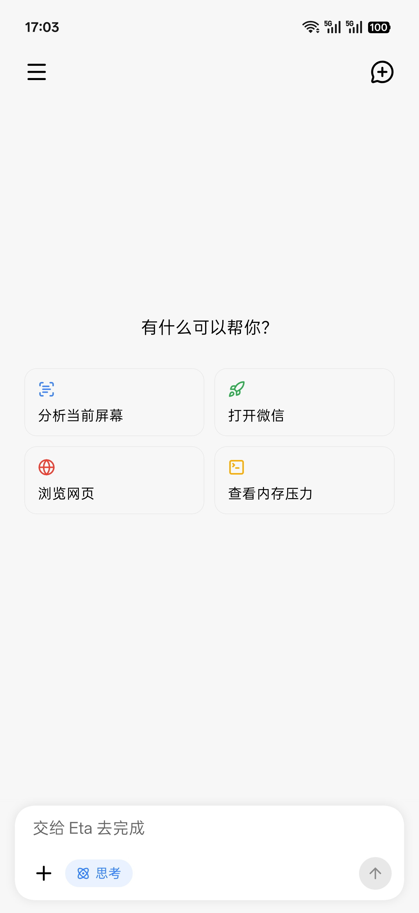
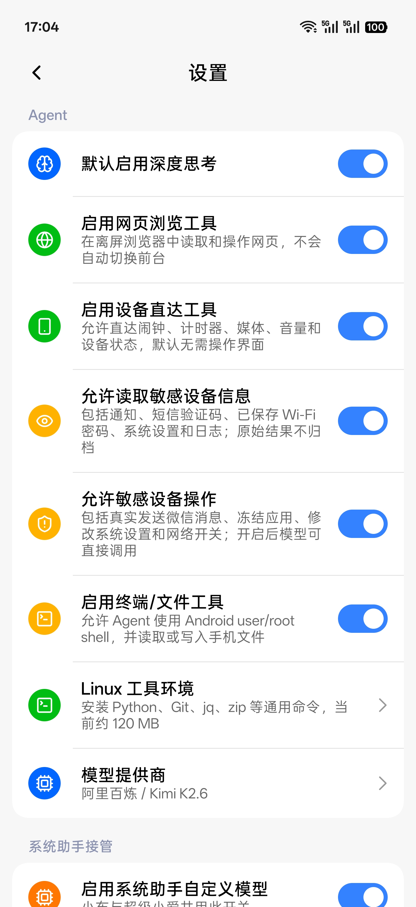

# Eta 한국어판

<p align="center"><strong>Android용 시스템 수준 AI 에이전트</strong></p>

<p align="center">구조화된 기기 도구, 크로스 앱 GUI 조작, Root Shell, Linux 터미널을 한 에이전트에서 조합하는 ColorOS용 Android AI 에이전트입니다.</p>

> 이 저장소는 [Mangi-11/Eta](https://github.com/Mangi-11/Eta)의 한국어 현지화 포크입니다. 앱의 사용자 노출 문구와 에이전트 메시지를 한국어로 번역하며, 원본의 도구 식별자·프로토콜·외부 앱 자동화용 고정 문자열은 호환성을 위해 유지합니다.

Eta는 libxposed API 102 기반 Xposed 모듈이며 ColorOS 16을 대상으로 합니다. Breeno 대화 요청을 가로채 같은 에이전트 런타임으로 전달하고, BYOK 방식으로 사용자가 선택한 모델을 연결합니다. 앱 본체가 기본 작업 공간이며 Gemini 호출과 서클 투 서치 관련 초기 훅도 포함합니다.

## 화면

| GUI 에이전트 | Breeno BYOK |
| :---: | :---: |
|  |  |

| 채팅 홈 | 시스템 분석 | 명령 실행 |
| :---: | :---: | :---: |
|  |  |  |

| 설정 | 도구 | 스킬 |
| :---: | :---: | :---: |
|  |  |  |

## 주요 기능

Eta는 모델이 명령을 생성하고, 시스템이 실행 결과를 돌려주며, 모델이 다음 단계를 결정하는 에이전트 루프로 작동합니다.

### GUI 조작

- 화면 캡처와 접근성 노드 읽기
- 노드 또는 좌표 탭, 길게 누르기, 방향 스크롤
- 앱 실행, 외부 링크 열기, 키 입력, 알림창 제어
- 텍스트 입력, 교체, 클립보드 작업
- 실행 중 오버레이와 제스처 피드백 표시

### 구조화된 기기 도구

가능한 작업은 설정 화면을 직접 조작하지 않고 Android 시스템 인터페이스로 실행합니다.

- 알람과 타이머 생성
- 미디어 재생 제어와 채널별 음량 조절
- 배터리, 메모리, 저장공간, 네트워크 상태 조회
- Wi-Fi와 블루투스 제어
- 메모리·저장공간 사용량이 큰 앱 조회
- 알림, SMS 인증번호, 저장된 Wi-Fi 정보, 제한된 시스템 로그 조회
- 보호 규칙 안에서 앱 중지·동결·복원 및 일부 Settings 수정
- 정확한 연락처 일치 후 WeChat 메시지 입력 또는 전송

민감 정보 읽기와 민감한 기기 조작은 별도 설정으로 기본 비활성화되어 있습니다. 도구 인수는 스키마와 실행기에서 검증되며, 핵심 시스템 패키지와 보안 관련 설정은 보호됩니다.

### 내장 브라우저

`browser_use`는 Eta 내부의 공유 WebView 세션을 사용합니다. JavaScript 페이지를 로드하고 본문과 링크를 추출하며, 요소 검색·조작·스크롤·캡처를 지원합니다.

- HTTPS만 허용
- SSL 오류를 무시하지 않음
- URL, DNS, 호스트 수, Service Worker 제한 적용
- 웹 콘텐츠를 신뢰할 수 없는 데이터로 취급
- 자동 제어 중 비 GET 요청 차단
- 로그인, 구매, 메시지 전송, 삭제 등은 사용자가 직접 인계받아 수행

### 터미널과 파일

사용자가 활성화한 경우 `user` 또는 `root` 권한으로 Shell 명령, 파일 작업, 로그 조회, 스크립트 실행을 지원합니다.

- `android`: Android 시스템, 앱, 로그, Magisk와 기기 파일 작업
- `linux`: 선택적으로 설치하는 Alpine 환경. Python, Git, Bash, jq, zip, OpenSSL, SQLite 등 제공

Linux 환경은 격리된 보안 샌드박스가 아닙니다.

### 스킬

- 공개 GitHub 저장소와 선별 목록에서 스킬 탐색·설치
- 단일 스킬 ZIP 가져오기
- 기존 사용자 스킬 충돌 검증
- 내장 스킬 덮어쓰기 금지
- 필요한 시점에만 스킬 본문과 리소스 읽기

설치는 파일 저장과 색인 생성만 수행하며 패키지 안의 스크립트를 자동 실행하지 않습니다.

## 설치

1. libxposed API 102를 지원하는 LSPosed 환경에 APK를 설치합니다.
2. 모듈 범위에 `system`, `SystemUI`, Google 앱, Breeno 관련 프로세스를 포함합니다.
3. 기기를 재부팅합니다.
4. Eta 앱에서 모델 제공자, API Key, 사용할 모델을 설정합니다.
5. 필요에 따라 오버레이, 접근성, 앱 목록, 위치, 백그라운드 권한을 부여합니다.
6. 필요한 기능만 선택해 Breeno 연동, 민감 정보 조회, 민감 기기 조작, 터미널·파일 도구를 활성화합니다.

## 지원 환경과 주의사항

- 대상 시스템: ColorOS 16
- Android 최소 버전: API 36
- Xposed 훅 지점은 OPPO·Google 앱 구현에 의존하므로 시스템이나 앱의 큰 업데이트 후 재적응이 필요할 수 있습니다.
- Root, Xposed, 접근성, 터미널 기능은 기기 제어 범위가 큽니다. 기능별 권한과 실행 결과를 확인한 뒤 사용해야 합니다.
- 외부 앱의 로그인, 결제, 자동화 방지 정책은 Eta가 우회하지 않습니다.

## 빌드

이 포크는 GitHub Actions에서 다음 검사를 수행합니다.

```text
./gradlew testDebugUnitTest
./gradlew lintDebug
./gradlew assembleDebug
```

성공한 워크플로 실행의 Artifacts에서 설치 가능한 디버그 APK를 받을 수 있습니다.

로컬 빌드 요구사항:

- JDK 25
- Gradle Wrapper 9.6.1
- Android SDK 37

```bash
./gradlew assembleDebug
```

APK 경로:

```text
app/build/outputs/apk/debug/app-debug.apk
```

## 프로젝트 구조

```text
app/src/main/kotlin/fuck/andes/
├── ModuleMain.kt          Xposed 모듈 진입점
├── hook/                  시스템·Google·Breeno 훅
├── agent/runtime/         에이전트 런타임과 IPC
├── agent/model/           모델 제공자와 프로토콜
├── agent/tool/            로컬 도구 실행기
├── agent/browser/         내장 브라우저
├── agent/device/          Root·접근성 기기 제어
├── agent/terminal/        Android·Alpine 터미널
├── agent/overlay/         실행 오버레이
├── agent/skill/           스킬 설치·검증·색인
├── data/                  Room과 저장소 계층
└── ui/                    Compose UI
```

에이전트 루프와 런타임 설계는 [docs/AGENT_RUNTIME.md](docs/AGENT_RUNTIME.md), 시스템 훅과 RemotePreferences 구조는 [docs/TECHNICAL.md](docs/TECHNICAL.md)를 참고하세요. 기술 문서는 현재 원문을 유지합니다.

## 원본과 크레딧

- 원본 프로젝트: [Mangi-11/Eta](https://github.com/Mangi-11/Eta)
- Pi Coding Agent
- OpenOmniBot
- Operit

제3자 자산과 라이선스 정보는 [docs/THIRD_PARTY_NOTICES.md](docs/THIRD_PARTY_NOTICES.md)에 있습니다.
